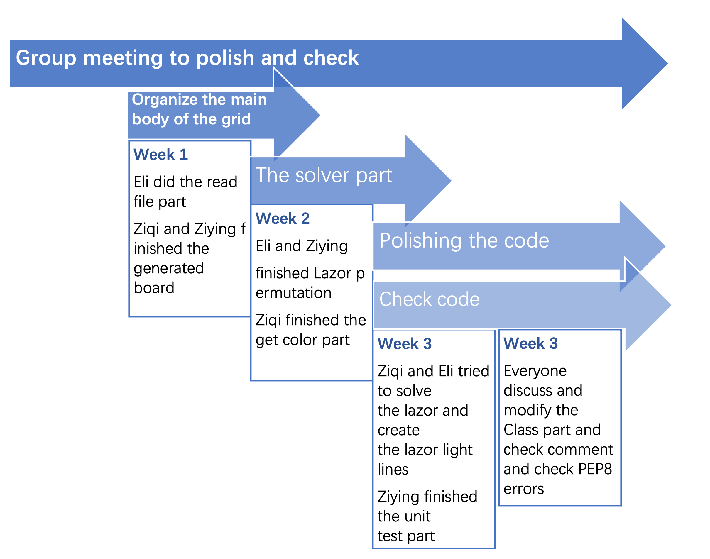

# Lazor_Project
This is the repository for the Lazor Project done by Eli Kengmana, Ziqi Chen, and Ziying Xu.

The project uses a permutation method to solve the puzzles that was originally found by a previous group doing the Lazor Project: Kuan-Lin Chen, Josh Cole, Katherine Miller, and Yi Li. Credit goes to them for a highly optimized method using the sympy multiset permutations algorithm. 

In our project, we modified how to read in the files by creating separate functions each dedicated for reading sections of the .bff file. In addition, created a separate Lazor class to be the source of lazor positions and directions.

Our project elaborated further on the readability of the output file by providing an image not only of the block positions, but also a trace of the lazors in the puzzle as well as the points they are crossing over. 

